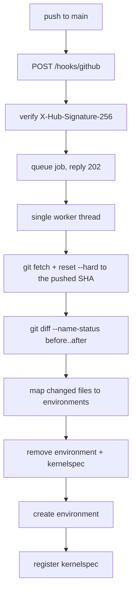

# brightcon-environ

A small REST service that listens for GitHub push webhooks and rebuilds the
Python environments offered by a JupyterHub. When a commit lands on `main` --
directly or through a merged pull request -- every environment whose definition
file changed is torn down and created again from scratch, and its Jupyter
kernelspec is re-registered.

Three definition formats are supported: mamba/conda `environment` YAML, pip
requirement lists, and uv project metadata.

## How an environment gets its name

Conda YAML files can carry a `name:` key, but a `requirements.txt` has nowhere
to record one. The convention here is therefore filename driven, so all three
formats name their environment the same way:

| File | Backend | Environment name |
| --- | --- | --- |
| `environment-<name>.yml` / `.yaml` | mamba/conda | the inner `name:` if present, otherwise `<name>` |
| `environment.yml` / `.yaml` | mamba/conda | the inner `name:`, which is then required |
| `requirements-<name>.txt` | uv (or pip) into a venv | `<name>` |
| `requirements-<name>.lock` | pinned input for the same environment | `<name>` |
| `pyproject-<name>.toml` | uv, from the project metadata | `<name>` |

Files may live anywhere in the repository, at any depth. Set
`defaults.search_roots` to restrict the scan to particular directories.

Names must match `^[a-z0-9][a-z0-9._-]{0,63}$` and must not be one of `user`,
`hub`, `base`, `root`, `python3`, `envs` or `share`. Anything else is refused
before a single command runs; this is what keeps the teardown step from being
able to touch a path outside the environment root.

### Optional headers

A filename can only carry a name, so two header comments fill the gaps. Both are
ordinary comments that pip and uv ignore, and only the leading comment block of
the file is read:

```
# python: 3.12
# display-name: Brightcon 2026 Basic

pandas
matplotlib
```

Without `# python:` the version from `defaults.python` is used. Without
`# display-name:` the kernel is labelled with the environment name.

For `pyproject-<name>.toml` the equivalents live in the TOML itself:

```toml
[project]
requires-python = ">=3.12"
dependencies = ["pandas", "matplotlib"]

[tool.environ]
display-name = "Brightcon 2026 Basic"
```

A `requirements-<name>.lock` beside a `requirements-<name>.txt` wins: the
environment is then built with `uv pip sync`, giving exactly the pinned set.

## What happens on a push



GitHub is answered immediately with `202 Accepted` and a job id, because a
rebuild takes far longer than a webhook delivery timeout. Jobs run one at a
time, so two pushes landing together cannot fight over the same directory.

A few details worth knowing:

- Deleting a definition file removes the environment and its kernel. The name of
  a deleted conda file is recovered from the state file, since its `name:` key
  is no longer readable.
- An environment is skipped when the definition's git blob hash is unchanged
  since the last successful build and the environment and kernel are both still
  on disk. Use `--force` or `POST /rebuild` with `"force": true` to override.
- If the `before` commit is unknown (a first run, a force push, a new branch),
  the service falls back to scanning every definition file.
- A build that fails is cleaned up rather than left half-finished, so a broken
  kernel never appears in the UI.

## Path layout

Identical on a laptop and on a real TLJH box, so nothing but the tool paths
changes between them:

```
/opt/tljh/user/envs/<name>              the environment itself
/opt/tljh/user/share/jupyter/kernels/   kernelspecs, shared by all hub users
/opt/tljh/environ/repo                  the clone of the watched repository
/opt/tljh/environ/state/environments.json
/opt/tljh/environ/logs/<timestamp>-<job>.log
/opt/tljh/config/environ.toml           configuration
```

Environments are always created with an explicit prefix, never with
`conda create -n`, so the result never depends on `envs_dirs` or `.condarc`.
Kernels are registered the way TLJH documents it:

```bash
/opt/tljh/user/envs/<name>/bin/python -m ipykernel install \
    --prefix /opt/tljh/user --name <name> --display-name "..."
```

The only difference between the two deployments is `[tools]`:

| | local Fedora box | TLJH server |
| --- | --- | --- |
| `conda` | `/home/localuser/miniforge3/bin/mamba` | `/opt/tljh/user/bin/mamba` |
| `uv` | `/home/localuser/.local/bin/uv` | `/opt/tljh/user/bin/uv` |

uv is not part of a stock TLJH install; add it with
`sudo -E /opt/tljh/user/bin/conda install -c conda-forge uv`.

## Local setup

A plain JupyterHub is not TLJH, so it does not look inside
`/opt/tljh/user/share/jupyter` for kernels. It does look in
`/usr/local/share/jupyter`, so the bootstrap script links the two together. On a
real TLJH install no bridge is needed, because the single-user server's
`sys.prefix` already is `/opt/tljh/user`.

```bash
sudo scripts/bootstrap-local.sh
sudo cp deploy/config.local.toml /opt/tljh/config/environ.toml
sudo $EDITOR /opt/tljh/config/environ.toml       # set repo.url

uv sync
export ENVIRON_CONFIG=/opt/tljh/config/environ.toml
export GITHUB_WEBHOOK_SECRET=$(openssl rand -hex 32)
export ENVIRON_ADMIN_TOKEN=$(openssl rand -hex 32)
```

Check what would be built before building anything:

```bash
uv run environ plan --repo /path/to/a/definitions/repo
```

Build for real, then look at the result:

```bash
sudo -E uv run environ sync --all
uv run environ list
```

Restart your single-user server from the JupyterHub control panel and the new
kernels appear in the launcher. The hub itself does not need restarting.

## Running the service

```bash
uv run environ serve            # http://127.0.0.1:8787
```

| Endpoint | Purpose |
| --- | --- |
| `POST /hooks/github` | webhook receiver; requires a valid signature |
| `POST /rebuild` | manual trigger; requires `Authorization: Bearer $ENVIRON_ADMIN_TOKEN` |
| `GET /healthz` | liveness and current configuration summary |
| `GET /jobs`, `GET /jobs/{id}` | job history, status and log tail |
| `GET /environments` | what is built, and whether it is still on disk |

`GITHUB_WEBHOOK_SECRET` is mandatory: without it the webhook endpoint returns
`503` and refuses every delivery rather than accepting unauthenticated builds.

As a systemd unit:

```bash
sudo cp deploy/brightcon-environ.service /etc/systemd/system/
sudo cp deploy/brightcon-environ.env.example /etc/brightcon-environ.env
sudo chmod 600 /etc/brightcon-environ.env
sudo $EDITOR /etc/brightcon-environ.env         # set both secrets
sudo systemctl enable --now brightcon-environ
journalctl -u brightcon-environ -f
```

The unit runs as root because creating environments under `/opt/tljh/user` and
writing shared kernelspecs are root operations -- the same ones a TLJH admin
performs with `sudo` from a notebook terminal.

## Testing without GitHub

`scripts/fake-webhook.py` signs a push payload with your secret and posts it, so
the signature check, the ref filter, the diff and the rebuild all run for real:

```bash
scripts/fake-webhook.py --repo /opt/tljh/environ/repo --watch
scripts/fake-webhook.py --first-push --watch    # null before-SHA: full scan
scripts/fake-webhook.py --bad-signature         # expect HTTP 401
scripts/fake-webhook.py --event ping            # expect {"pong": true}
```

## Receiving real deliveries

A laptop is not reachable from GitHub, so point the webhook at a tunnel:

```bash
# smee.io
npx smee-client --url https://smee.io/<channel> --target http://127.0.0.1:8787/hooks/github

# or cloudflared
cloudflared tunnel --url http://127.0.0.1:8787
```

In the repository settings, add a webhook with the tunnel URL, content type
`application/json`, the same secret as `GITHUB_WEBHOOK_SECRET`, and the *Just the
push event* trigger. Merged pull requests arrive as pushes to `main`, so no
separate `pull_request` subscription is needed.

For a private repository, generate a deploy key, add the public half to the
repository with read access, and point `repo.ssh_key` at the private half.

## Development

Notable changes are recorded in [CHANGES.md](CHANGES.md).

```bash
uv sync
uv run pytest -m "not slow"    # fast: no network, no real environments
uv run pytest                  # also builds a real venv with uv
```

Formatting and linting are handled by ruff, wired up through pre-commit. Install
the git hook once after cloning:

```bash
uv run pre-commit install
uv run pre-commit run --all-files   # optional: check everything now
```

Or run ruff directly:

```bash
uv run ruff format .
uv run ruff check --fix .
```

Module map:

| Module | Responsibility |
| --- | --- |
| `config.py` | TOML configuration; secrets come from the environment |
| `security.py` | HMAC signature and bearer token checks |
| `git_repo.py` | clone, fetch, hard reset, diff, blob hashes |
| `discovery.py` | filenames and headers to `EnvSpec` |
| `builders.py` | create and destroy environments, with path confinement |
| `kernels.py` | kernelspec install and removal |
| `jobs.py` | queue, worker, per-job logs, persisted state |
| `app.py` | FastAPI routes |
| `cli.py` | the `environ` command |
| `runner.py` | subprocess wrapper; argument lists only, never a shell |
