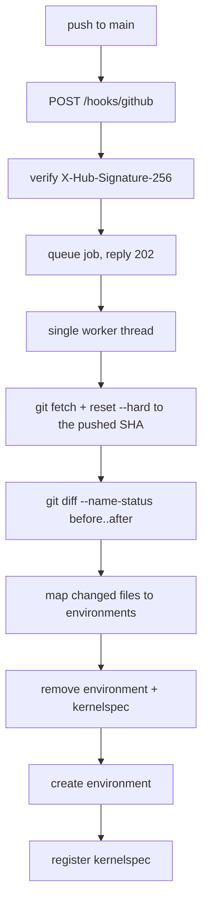

# brightcon-environ

A small REST service that listens for GitHub push webhooks and rebuilds the
Python environments offered by a JupyterHub. When a commit lands on `main` --
directly or through a merged pull request -- every environment whose definition
file changed is torn down and created again from scratch, and its Jupyter
kernelspec is re-registered.

Three definition formats are supported: mamba/conda `environment` YAML, pip
requirement lists, and uv project metadata.

## How an environment gets its name

Conda YAML files can carry a `name:` key, but a `requirements.txt` has nowhere
to record one. The convention here is therefore filename driven, so all three
formats name their environment the same way:

| File | Backend | Environment name |
| --- | --- | --- |
| `environment-<name>.yml` / `.yaml` | mamba/conda | the inner `name:` if present, otherwise `<name>` |
| `environment.yml` / `.yaml` | mamba/conda | the inner `name:`, which is then required |
| `requirements-<name>.txt` | uv (or pip) into a venv | `<name>` |
| `requirements-<name>.lock` | pinned input for the same environment | `<name>` |
| `pyproject-<name>.toml` | uv, from the project metadata | `<name>` |

Files may live anywhere in the repository, at any depth. Set
`defaults.search_roots` to restrict the scan to particular directories.

Names must match `^[a-z0-9][a-z0-9._-]{0,63}$` and must not be one of `user`,
`hub`, `base`, `root`, `python3`, `envs` or `share`. Anything else is refused
before a single command runs; this is what keeps the teardown step from being
able to touch a path outside the environment root.

### Optional headers

A filename can only carry a name, so two header comments fill the gaps. Both are
ordinary comments that pip and uv ignore, and only the leading comment block of
the file is read:

```
# python: 3.12
# display-name: Brightcon 2026 Basic

pandas
matplotlib
```

Without `# python:` the version from `defaults.python` is used. Without
`# display-name:` the kernel is labelled with the environment name.

For `pyproject-<name>.toml` the equivalents live in the TOML itself:

```toml
[project]
requires-python = ">=3.12"
dependencies = ["pandas", "matplotlib"]

[tool.environ]
display-name = "Brightcon 2026 Basic"
```

A `requirements-<name>.lock` beside a `requirements-<name>.txt` wins: the
environment is then built with `uv pip sync`, giving exactly the pinned set.

## What happens on a push



GitHub is answered immediately with `202 Accepted` and a job id, because a
rebuild takes far longer than a webhook delivery timeout. Jobs run one at a
time, so two pushes landing together cannot fight over the same directory.

A few details worth knowing:

- Deleting a definition file removes the environment and its kernel. The name of
  a deleted conda file is recovered from the state file, since its `name:` key
  is no longer readable.
- An environment is skipped when the definition's git blob hash is unchanged
  since the last successful build and the environment and kernel are both still
  on disk. Use `--force` or `POST /rebuild` with `"force": true` to override.
- If the `before` commit is unknown (a first run, a force push, a new branch),
  the service falls back to scanning every definition file.
- A build that fails is cleaned up rather than left half-finished, so a broken
  kernel never appears in the UI.

## Path layout

```
/opt/tljh/user/envs/<name>              the environment itself
/opt/tljh/user/share/jupyter/kernels/   kernelspecs, shared by all hub users
/opt/tljh/environ/repo/                 the clone of the watched repository
/opt/tljh/environ/venv/                 dedicated venv for the service itself
/opt/tljh/environ/cache/                tool caches (uv, conda)
/opt/tljh/environ/state/environments.json
/opt/tljh/environ/logs/<timestamp>-<job>.log
/opt/tljh/config/environ.toml           configuration
/etc/brightcon-environ.env              secrets (mode 0600, never world-readable)
```

There are **two different repositories** involved:

| Repository | Role | Location on server |
| --- | --- | --- |
| **This repo** (brightcon-environ) | The webhook service source code | e.g. `/usr/local/share/brightcon-environ` |
| **Your definitions repo** | `requirements-*.txt`, `environment-*.yml`, etc. | Auto-cloned to `/opt/tljh/environ/repo` |

You configure the definitions repo URL in `environ.toml` as `repo.url`; the
service clones it on first use and keeps it in sync on every push. You do not
need to clone the definitions repo manually.

Environments are always created with an explicit prefix, never with
`conda create -n`, so the result never depends on `envs_dirs` or `.condarc`.
Kernels are registered the way TLJH documents it:

```bash
/opt/tljh/user/envs/<name>/bin/python -m ipykernel install \
    --prefix /opt/tljh/user --name <name> --display-name "..."
```

## Deploying on a TLJH server (Ubuntu)

This section covers a fresh deployment on a server running The Littlest
JupyterHub. The service runs in its own venv, separate from `/opt/tljh/user`,
so it does not pollute the environment shared by hub users.

### Prerequisites

uv is not part of a stock TLJH install. Add it to the user environment so the
service can use it to create venvs:

```bash
sudo -E /opt/tljh/user/bin/conda install -c conda-forge uv
```

### Step 1: Clone the service source

Pick any location readable by root. `/usr/local/share` is a good choice:

```bash
sudo git clone https://github.com/YOUR-ORG/brightcon-environ.git \
    /usr/local/share/brightcon-environ
```

### Step 2: Create the service venv and install

This project requires Python >= 3.14. Use uv to pull the right interpreter
into a dedicated venv (not the TLJH user environment):

```bash
sudo mkdir -p /opt/tljh/environ
sudo /opt/tljh/user/bin/uv venv --python 3.14 /opt/tljh/environ/venv
sudo /opt/tljh/user/bin/uv pip install \
    --python /opt/tljh/environ/venv/bin/python \
    /usr/local/share/brightcon-environ
```

Verify:

```bash
/opt/tljh/environ/venv/bin/environ --version
```

### Step 3: Create the directory layout

```bash
sudo mkdir -p \
    /opt/tljh/user/envs \
    /opt/tljh/user/share/jupyter/kernels \
    /opt/tljh/config \
    /opt/tljh/environ/repo \
    /opt/tljh/environ/state \
    /opt/tljh/environ/logs \
    /opt/tljh/environ/cache/uv \
    /opt/tljh/environ/cache/conda/pkgs
sudo chmod -R a+rX /opt/tljh
```

On a real TLJH box most of this tree already exists. The key additions are
`/opt/tljh/environ/` (for the service) and the `cache/` subtree.

### Step 4: Configuration

```bash
sudo cp /usr/local/share/brightcon-environ/deploy/config.tljh.toml \
        /opt/tljh/config/environ.toml
sudo $EDITOR /opt/tljh/config/environ.toml
```

At minimum, set `repo.url` to your definitions repository. For public repos use
an HTTPS URL; for private repos see the SSH deploy key section below.

```toml
[repo]
url = "https://github.com/YOUR-ORG/your-definitions-repo.git"
```

### Step 5: Secrets

Secrets live in `/etc/brightcon-environ.env`, **not** in `environ.toml`. On a
TLJH server every hub user is a real system user with terminal access, and the
`/opt/tljh` tree is world-readable. Putting secrets there would expose them to
every student.

```bash
sudo install -m 600 /dev/null /etc/brightcon-environ.env
```

Edit the file and set the secrets:

```
GITHUB_WEBHOOK_SECRET=<paste the same secret you configure on the GitHub webhook>
ENVIRON_ADMIN_TOKEN=<a token of your choice for manual POST /rebuild calls>
GITHUB_APP_ID=<App ID integer>
GITHUB_APP_INSTALLATION_ID=<installation ID integer>
GITHUB_APP_PRIVATE_KEY_FILE=/etc/brightcon-environ/github-app.pem
```

Generate strong random values for the webhook secret and admin token with:

```bash
openssl rand -hex 32
```

Check Runs require a **GitHub App** (not a PAT). Create it under the org that
owns the definitions repo, disable the App webhook, grant **Checks: Read and
write**, install on the definitions repo only, then set App ID, installation
ID and PEM path in the env file. Full walkthrough:
[`docs/github-app.md`](docs/github-app.md).

| Variable | Purpose |
| --- | --- |
| `GITHUB_WEBHOOK_SECRET` | Shared secret for `X-Hub-Signature-256` verification. Must match the secret in GitHub webhook settings. |
| `ENVIRON_ADMIN_TOKEN` | Bearer token for the `POST /rebuild` endpoint. Only needed if you want to trigger manual rebuilds via the API. |
| `GITHUB_APP_ID` | Optional. GitHub App ID for Check Runs. |
| `GITHUB_APP_INSTALLATION_ID` | Optional. Installation ID on the definitions repo. |
| `GITHUB_APP_PRIVATE_KEY_FILE` | Optional. Path to the App private key PEM. |

`ENVIRON_CONFIG` is **not** a secret -- it is a plain path to the configuration
file and is set in the systemd unit, not in the env file.

### Step 6: systemd

```bash
sudo cp /usr/local/share/brightcon-environ/deploy/brightcon-environ.service \
        /etc/systemd/system/
sudo systemctl daemon-reload
sudo systemctl enable --now brightcon-environ
```

Check that it started:

```bash
sudo systemctl status brightcon-environ
sudo journalctl -u brightcon-environ -n 20
```

### Step 7: Configure the GitHub webhook

In your **definitions** repository (not this one), go to Settings -> Webhooks
and add a webhook:

- **Payload URL**: `https://your-server/path/to/hooks/github`
  (the route is `/hooks/github`, **not** `/`)
- **Content type**: **`application/json`** (not `application/x-www-form-urlencoded`)
- **Secret**: the same value as `GITHUB_WEBHOOK_SECRET` in `/etc/brightcon-environ.env`
- **Events**: **Pushes** and **Pull requests** (not “Just the push event”)

Pull requests targeting the watched branch are **validated** in staging (no live
kernels). Merges still arrive as pushes to `main` and **apply** to the hub.

### Step 8: Verify

Push a commit to `main` in your definitions repo (or redeliver an existing
webhook from the GitHub UI), then check:

```bash
# Job status (use the job id from the webhook response or the journal)
curl -s https://your-server/path/to/jobs | python3 -m json.tool

# List built environments
curl -s https://your-server/path/to/environments | python3 -m json.tool

# Or from the CLI on the server
sudo ENVIRON_CONFIG=/opt/tljh/config/environ.toml \
    /opt/tljh/environ/venv/bin/environ list
```

After a successful build, restart your single-user server from the JupyterHub
control panel. The new kernels appear in the launcher. The hub itself does not
need restarting.

### Private repositories and SSH deploy keys

For a private definitions repo, use an SSH deploy key. Keep the private key
alongside the other secrets, **not** under `/opt/tljh` (which is world-readable):

```bash
sudo mkdir -p /etc/brightcon-environ
sudo ssh-keygen -t ed25519 -f /etc/brightcon-environ/deploy_key -N "" -C "brightcon-environ"
sudo chmod 600 /etc/brightcon-environ/deploy_key
```

Add the public key to your definitions repo on GitHub (Settings -> Deploy keys,
read access is sufficient):

```bash
sudo cat /etc/brightcon-environ/deploy_key.pub
```

Then set both the URL and key in `/opt/tljh/config/environ.toml`:

```toml
[repo]
url = "git@github.com:YOUR-ORG/your-definitions-repo.git"
ssh_key = "/etc/brightcon-environ/deploy_key"
```

Restart the service after changing the config:

```bash
sudo systemctl restart brightcon-environ
```

### Updating the service

After pulling new code into the source clone:

```bash
cd /usr/local/share/brightcon-environ
sudo git pull
sudo /opt/tljh/user/bin/uv pip install \
    --python /opt/tljh/environ/venv/bin/python \
    /usr/local/share/brightcon-environ
sudo systemctl restart brightcon-environ
```

If the systemd unit file changed, also re-copy it:

```bash
sudo cp /usr/local/share/brightcon-environ/deploy/brightcon-environ.service \
        /etc/systemd/system/
sudo systemctl daemon-reload
sudo systemctl restart brightcon-environ
```

## API endpoints

| Endpoint | Purpose |
| --- | --- |
| `POST /hooks/github` | Webhook receiver; requires a valid `X-Hub-Signature-256` |
| `POST /rebuild` | Manual trigger; requires `Authorization: Bearer $ENVIRON_ADMIN_TOKEN` |
| `GET /healthz` | Liveness check and current configuration summary |
| `GET /jobs` | Recent job history |
| `GET /jobs/{id}` | Single job status, outcome and log tail |
| `GET /environments` | What is built, and whether it is still on disk |

`GITHUB_WEBHOOK_SECRET` is mandatory: without it the webhook endpoint returns
`503` and refuses every delivery rather than accepting unauthenticated builds.

## Troubleshooting

### Viewing logs

```bash
sudo journalctl -u brightcon-environ -f          # live tail
sudo journalctl -u brightcon-environ -n 100       # last 100 lines
sudo systemctl status brightcon-environ           # quick status + recent output
```

Per-job logs are also written to `/opt/tljh/environ/logs/` and are returned by
`GET /jobs/{id}`.

### `404 Not Found` on webhook delivery

GitHub is posting to the wrong path. The webhook route is `/hooks/github`, not
`/`. Update the **Payload URL** in the GitHub webhook settings to include the
full path, e.g. `https://your-server/hooks/github`.

### `invalid JSON` error on webhook delivery

The webhook content type is wrong. In the GitHub webhook settings, change
**Content type** from `application/x-www-form-urlencoded` to
**`application/json`**.

### `Failed at step NAMESPACE` / systemd refuses to start

```
Failed to set up mount namespacing: /some/path: No such file or directory
```

The systemd unit lists paths in `ReadWritePaths=` that do not exist yet.
Create the missing directories before starting the service:

```bash
sudo mkdir -p /opt/tljh/environ/cache/uv /opt/tljh/environ/cache/conda/pkgs
sudo systemctl daemon-reload
sudo systemctl restart brightcon-environ
```

### `Read-only file system` from uv or conda

```
Could not create temporary file
Caused by: Read-only file system (os error 30) at path "/root/.cache/uv/..."
```

The systemd unit has `ProtectHome=read-only`, which makes `/root` read-only.
Tool caches must be redirected elsewhere. The current unit file already sets
`UV_CACHE_DIR`, `CONDA_PKGS_DIRS` and `XDG_CACHE_HOME` to directories under
`/opt/tljh/environ/cache/`. If you are using an older version of the unit file,
update it from `deploy/brightcon-environ.service` and re-copy.

### `dubious ownership` from git

```
fatal: detected dubious ownership in repository at '/opt/tljh/environ/repo'
```

The clone was created by a different user than the one running the service
(root). Fix the ownership and mark the directory as safe:

```bash
sudo chown -R root:root /opt/tljh/environ/repo
sudo git -C /opt/tljh/environ/repo config --local safe.directory /opt/tljh/environ/repo
```

### `Permission denied (publickey)` on fetch

The service cannot authenticate to GitHub. For a public repo, use an HTTPS URL
in `repo.url`. For a private repo, set up a deploy key (see the section above)
and make sure `repo.ssh_key` points at the private key file.

### Environments build but kernels do not appear in JupyterHub

Restart your single-user server from the JupyterHub control panel (Hub ->
Control Panel -> Stop My Server, then Start My Server). The hub itself does not
need restarting. Kernels are installed into `/opt/tljh/user/share/jupyter/kernels/`,
which is on the TLJH kernel search path.

On a non-TLJH JupyterHub the path may not be searched. In that case either
symlink `/usr/local/share/jupyter` to `/opt/tljh/user/share/jupyter`, or add
`JUPYTER_PATH=/opt/tljh/user/share/jupyter` to the spawner environment in
`jupyterhub_config.py`.

### Checking what would be built (dry run)

```bash
sudo ENVIRON_CONFIG=/opt/tljh/config/environ.toml \
    /opt/tljh/environ/venv/bin/environ plan --repo /opt/tljh/environ/repo
```

### Forcing a rebuild of everything

```bash
sudo ENVIRON_CONFIG=/opt/tljh/config/environ.toml \
    /opt/tljh/environ/venv/bin/environ sync --all --force
```

Or via the API:

```bash
curl -X POST https://your-server/path/to/rebuild \
    -H "Authorization: Bearer $ENVIRON_ADMIN_TOKEN" \
    -H "Content-Type: application/json" \
    -d '{"force": true}'
```

## Local development setup

A plain JupyterHub is not TLJH, so it does not look inside
`/opt/tljh/user/share/jupyter` for kernels. It does look in
`/usr/local/share/jupyter`, so the bootstrap script links the two together. On a
real TLJH install no bridge is needed, because the single-user server's
`sys.prefix` already is `/opt/tljh/user`.

```bash
sudo scripts/bootstrap-local.sh
sudo cp deploy/config.local.toml /opt/tljh/config/environ.toml
sudo $EDITOR /opt/tljh/config/environ.toml       # set repo.url

uv sync
export ENVIRON_CONFIG=/opt/tljh/config/environ.toml
export GITHUB_WEBHOOK_SECRET=$(openssl rand -hex 32)
export ENVIRON_ADMIN_TOKEN=$(openssl rand -hex 32)
```

Check what would be built before building anything:

```bash
uv run environ plan --repo /path/to/a/definitions/repo
```

Build for real, then look at the result:

```bash
sudo -E uv run environ sync --all
uv run environ list
```

Restart your single-user server from the JupyterHub control panel and the new
kernels appear in the launcher. The hub itself does not need restarting.

### Testing without GitHub

`scripts/fake-webhook.py` signs a push payload with your secret and posts it, so
the signature check, the ref filter, the diff and the rebuild all run for real:

```bash
scripts/fake-webhook.py --repo /opt/tljh/environ/repo --watch
scripts/fake-webhook.py --first-push --watch    # null before-SHA: full scan
scripts/fake-webhook.py --bad-signature         # expect HTTP 401
scripts/fake-webhook.py --event ping            # expect {"pong": true}
```

### Receiving deliveries on a local machine

A laptop is not reachable from GitHub, so point the webhook at a tunnel:

```bash
# smee.io
npx smee-client --url https://smee.io/<channel> --target http://127.0.0.1:8787/hooks/github

# or cloudflared
cloudflared tunnel --url http://127.0.0.1:8787
```

## Development

Notable changes are recorded in [CHANGES.md](CHANGES.md). Longer-form docs live
under [`docs/`](docs/) and are published via Read the Docs
(`.readthedocs.yaml`). Build them locally with:

```bash
uv run --group docs sphinx-build -b html docs docs/_build/html
```

```bash
uv sync
uv run pytest -m "not slow"    # fast: no network, no real environments
uv run pytest                  # also builds a real venv with uv
```

Formatting and linting are handled by ruff, wired up through pre-commit. Install
the git hook once after cloning:

```bash
uv run pre-commit install
uv run pre-commit run --all-files   # optional: check everything now
```

Or run ruff directly:

```bash
uv run ruff format .
uv run ruff check --fix .
```

Module map:

| Module | Responsibility |
| --- | --- |
| `config.py` | TOML configuration; secrets come from the environment |
| `security.py` | HMAC signature and bearer token checks |
| `git_repo.py` | clone, fetch, hard reset, diff, blob hashes |
| `discovery.py` | filenames and headers to `EnvSpec` |
| `builders.py` | create and destroy environments, with path confinement |
| `kernels.py` | kernelspec install and removal |
| `jobs.py` | queue, worker, per-job logs, persisted state |
| `app.py` | FastAPI routes |
| `cli.py` | the `environ` command |
| `runner.py` | subprocess wrapper; argument lists only, never a shell |
